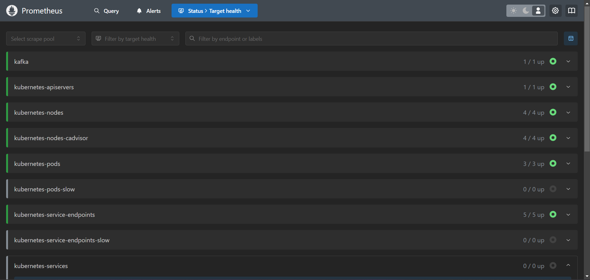
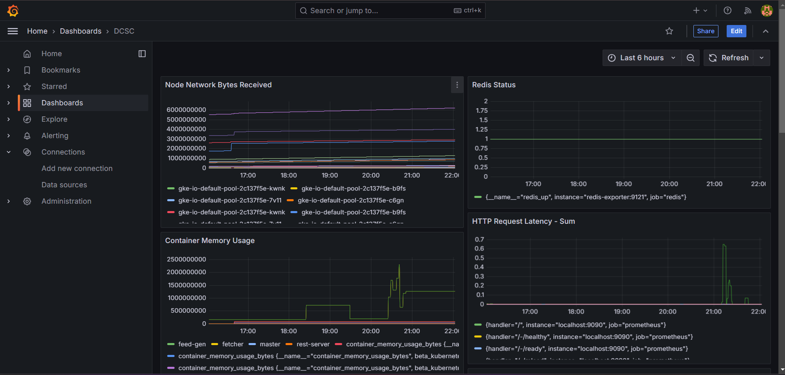

## Prometheus - Grafana Dashboards
<p float="left">
  
   
   
  
</p>

## Steps to Run the Project:

1. Create a GKE Cluster with atleast 4 nodes and `e2-highmem-4` machines
2. Clone the project onto gcloud, and run
    ```
    kubectl apply -f redis/deployment.yaml
    kubectl apply -f redis/service.yaml
    ```
3. Kafka Setup:
    ```
    helm install my-kafka oci://registry-1.docker.io/bitnamicharts/kafka #deploy kafka
    kubectl get --namespace default secrets/kafka-user-passwords -o jsonpath='{.data.client-passwords}' | base64 --decode #get passwords
    ```
4. Deploy nginx-ingress-controller:
    ```
    helm upgrade --install ingress-nginx ingress-nginx \
    --repo https://kubernetes.github.io/ingress-nginx \
    --namespace ingress-nginx --create-namespace  # Get nginx

    helm upgrade ingress-nginx ingress-nginx \
    --repo https://kubernetes.github.io/ingress-nginx \
    --namespace ingress-nginx \
    --set controller.metrics.enabled=true \
    --set-string controller.podAnnotations."prometheus\.io/scrape"="true" \
    --set-string controller.podAnnotations."prometheus\.io/port"="10254"  # set values for prometheus
    ```
4. Deploy Services:
    ```
    kubectl apply -f fetch/deployment.yaml
    kubectl apply -f feedgen/deployment.yaml
    kubectl apply -f web-backend/deployment.yaml
    kubectl apply -f web-backend/service.yaml
    kubectl apply -f web-backend/ingress.yaml
    ```
4. Install Prometheus and Grafana:
    ```
    helm install prometheus prometheus-community/prometheus
    kubectl expose service prometheus-server --type=LoadBalancer --port=9090 --target-port=9090 --name=prometheus-server-ext
    ```
5. Kafka and Kafka Exporter Setup:
    ```
    helm install kafka-exp prometheus-community/prometheus-kafka-exporter -f config/kafkaValues.yaml #install exporter with values
    ```
5. Deploy Redis Exporter and update prometheus:
    ```
    kubectl apply -f ks/redis-exporter-deployment.yaml 
    helm upgrade prometheus prometheus-community/prometheus -f config/promValues.yaml
    ``` 
6. Go to the "External-IP-Prometheus":9090, to check targets
7. Deploy Grafana
    ```
    helm install grafana grafana/grafana
    kubectl expose deployment grafana --port=3000 --target-port=3000  --name=grafana-ext --type=LoadBalancer #deploy
    kubectl get secret --namespace default grafana -o jsonpath="{.data.admin-password}" | base64 --decode #get password
    ```
8. Access grafana at "External-IP-Grafana":3000 and login with user=admin, password that we got earlier, and set prometheus data source as "External-IP-Prometheus":9090.
